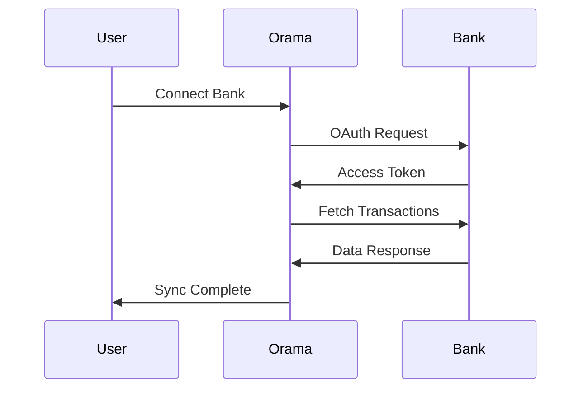

## Overview

Orama supports seamless integrations with major banks and third-party tools to automate your treasury management. Connect your accounts securely to import transactions in real-time, reconcile balances automatically, and trigger workflows based on financial data. This guide covers supported providers, setup steps, configuration options, and troubleshooting.

<Callout kind="info" collapsed="false">
  Orama uses OAuth 2.0 and API keys for secure connections. All data syncs are encrypted end-to-end.
</Callout>

## Supported Integrations

Orama integrates with leading Spanish and international banks, plus accounting and ERP tools. Choose from pre-built connectors for instant setup.

<Columns cols="3">
  <Card title="Banks" href="#banks" icon="database" horizontal="false">
    BBVA, Santander, CaixaBank, Sabadell
  </Card>

  <Card title="Accounting Tools" href="#tools" icon="file-text" horizontal="false">
    Holded, A3, Contasol
  </Card>

  <Card title="ERP Systems" href="#erp" icon="settings" horizontal="false">
    SAP, Odoo, custom APIs
  </Card>
</Columns>

| Category   | Providers                  | Sync Frequency |
| ---------- | -------------------------- | -------------- |
| Banks      | BBVA, Santander, CaixaBank | Real-time      |
| Accounting | Holded, A3                 | Daily/Hourly   |
| ERP        | Odoo, Custom               | On-demand      |

## Secure Connection Setup

Follow these steps to connect a bank account. The process takes under 5 minutes.

<Steps>
  <Step title="Select Provider" icon="search" title-type="p">
    In your Orama dashboard, navigate to Integrations > Banks. Choose your provider from the list.
  </Step>

  <Step title="Authorize Access" icon="shield" title-type="p">
    Click Connect. You'll be redirected to your bank's OAuth page. Grant read-only access to transactions and balances.
  </Step>

  <Step title="Configure Sync" icon="settings" title-type="p">
    Set sync interval (real-time, hourly, daily). Test the connection with a manual sync.
  </Step>

  <Step title="Verify Data" icon="check-circle" title-type="p">
    Review imported transactions in the Transactions tab. Resolve any mapping issues.
  </Step>
</Steps>

## Data Import Configuration

Configure imports differently based on the provider type. Use the dashboard UI for banks or API for tools.

<Tabs>
  <Tab title="Bank (OAuth)" icon="banknote">
    Banks use secure OAuth flows. No API keys needed.

    <Image src="https://example.com/bank-oauth.png" width="800" height="400" alt="Bank OAuth authorization flow" />
  </Tab>

  <Tab title="Tool (API Key)" icon="key">
    For accounting tools, generate an API key in the tool's settings.

    ```javascript
    // Example: Holded API key setup
    const config = {
      apiKey: 'YOUR_HOLDED_API_KEY',
      endpoint: 'https://api.holded.com/v1/transactions'
    };
    ```
  </Tab>
</Tabs>

## API-Based Integrations

For custom tools or ERPs, use Orama's REST API to push/pull data.

<Request show-lines="true" tabs={[]}>
  ```bash
  curl -X POST https://api.orama.ai/v1/integrations/sync \
    -H "Authorization: Bearer YOUR_API_KEY" \
    -H "Content-Type: application/json" \
    -d '{
      "provider": "custom",
      "data": {"balance": 15000.50}
    }'
  ```

  ```javascript
  const response = await fetch('https://api.orama.ai/v1/integrations/sync', {
    method: 'POST',
    headers: {
      'Authorization': `Bearer ${YOUR_API_KEY}`,
      'Content-Type': 'application/json'
    },
    body: JSON.stringify({
      provider: 'custom',
      data: { balance: 15000.50 }
    })
  });
  ```
</Request>

<Response show-lines="true" tabs={[]}>
  ```json
  {
    "status": "success",
    "synced": 42,
    "message": "Transactions imported successfully"
  }
  ```

  ```json
  {
    "error": "Invalid API key",
    "code": 401
  }
  ```
</Response>

<ParamField header="Authorization" param-type="string" required="true" deprecated="false">
  Bearer token obtained from your Orama dashboard.
</ParamField>

<ParamField body="provider" param-type="string" required="true" deprecated="false">
  Integration provider slug, e.g., `holded`, `custom`.
</ParamField>

## Troubleshooting Common Issues

<ExpandableGroup>
  <Expandable title="Connection Failed" default-open="true">
    - Check if your bank's OAuth session expired. Reconnect via dashboard.

    - Verify IP whitelisting if enabled by the provider.

    - Review Orama logs: <kbd>Settings</kbd> > <kbd>Integrations Logs</kbd>.
  </Expandable>

  <Expandable title="Sync Delays" default-open="false">
    Real-time sync requires bank API support. Fallback to hourly for legacy banks.
  </Expandable>

  <Expandable title="Data Mapping Errors" default-open="false">
    Use custom rules in Import Rules to map categories and accounts.
  </Expandable>
</ExpandableGroup>

<Callout kind="tip" collapsed="false">
  Monitor sync health in the dashboard. Set up alerts for failures via email or Slack webhook.
</Callout>



